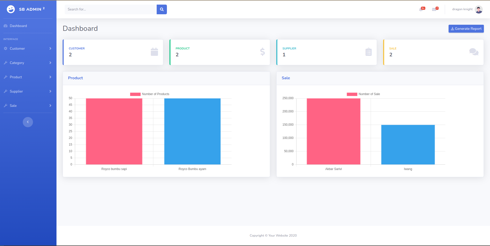
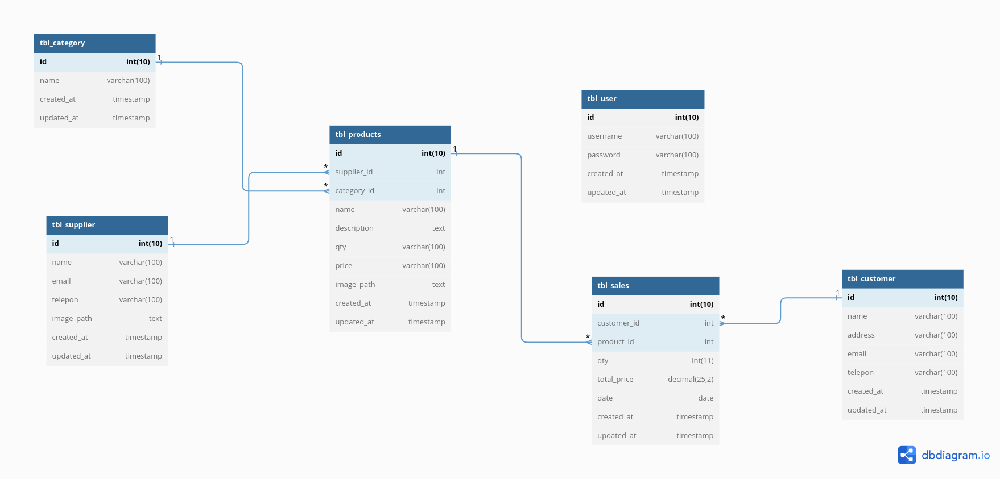

### Inventory Django

Tugas Kuliah Rpl

### How to use my project

- git clone https://github.com/renaldyhidayatt/inventorydjango
- pipenv install
- running `docker-compose up --build -d`

### Demo

### Design Database

