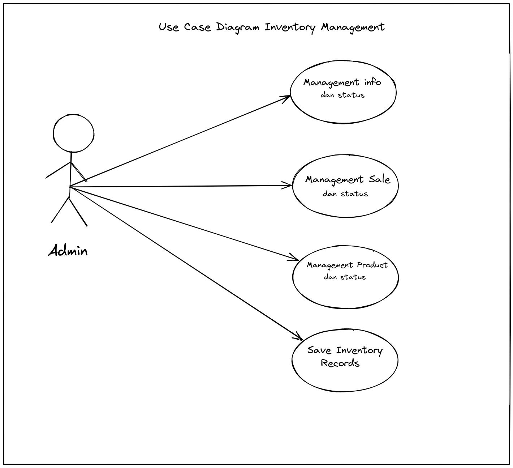
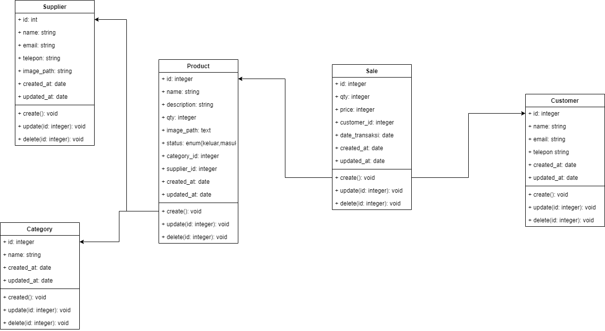

### Inventory Django

Tugas Kuliah Rpl

#### How to use my project

- git clone https://github.com/renaldyhidayatt/inventorydjango
- pipenv install
- running `docker-compose up --build -d`

#### Demo

#### Pembahasan Kasus
Pt. Afaiya butuh system dimana tracking barang masuk / barang keluar secara digital. Sistem yang dibuat ini menggunakan framework python Django dan menggunakan database mysql, untuk user interface menggunakan bootstrap 4.6.

#### Design Diagram(Uml)

#### Use Case
Merupakan model diagram UML yang digunakan untuk menggambarkan requirement fungsional yang diharapkan dari sebuah system.

#### Activity Diagram
Activity Diagram merupakan rancangan aliran aktivitas atau aliran kerja dalam sebuah sistem yang akan dijalankan. Activity Diagram juga digunakan untuk mendefinisikan atau mengelompokan aluran tampilan dari sistem tersebut. Activity Diagram memiliki komponen dengan bentuk tertentu yang dihubungkan dengan tanda panah. Panah tersebut mengarah ke-urutan aktivitas yang terjadi dari awal hingga akhir.

#### Class Diagram
Class diagram adalah sesuatu yang bisa membantu dalam memvisualisasikan struktur setiap kelas dari sebuah sistem. Bagian dari UML ini juga akan memperlihatkan kumpulan dari kelas, collaboration, interface dan relasi yang ada di dalam sistem.

#### Sequence Diagram
Sequence diagram atau diagram urutan adalah sebuah diagram yang digunakan untuk menjelaskan dan menampilkan interaksi antar objek-objek dalam sebuah sistem secara terperinci.

#### Deployment Diagram
untuk menggambarkan, memvisualisasikan, menspesifikasikan serta mendokumentasikan suatu proses yang terjadi dalam sebuah sistem berbasis OOP (Object Oriented Programming) yang akan dibangun.

#### Design Database
Desain Database atau basis data adalah proses menghasilkan detail (rinci) model data dari basis data (database). Tujuan dari desain database adalah untuk menentukan data-data yang dibutuhkan dalam sistem, sehingga informasi yang dihasilkan dapat terpenuhi dengan baik.

#### Testing
Usability Testing merupakan salah satu cara untuk mengetahui apakah user dapat mudah menggunakan aplikasi , seberapa efisien dan efektif sebuah aplikasi dapat membantu user mencapai tujuannya dan apakah user puas dengan aplikasi yang digunakan.

